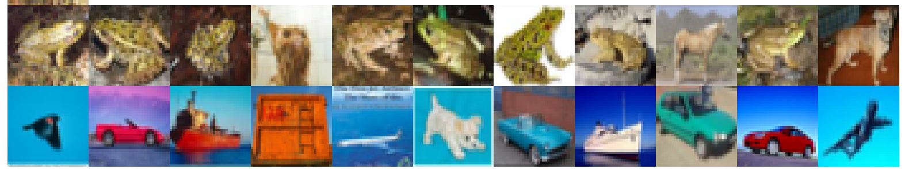
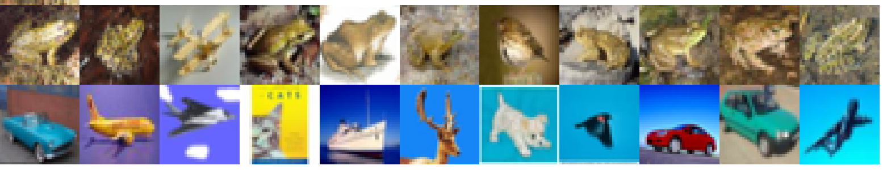
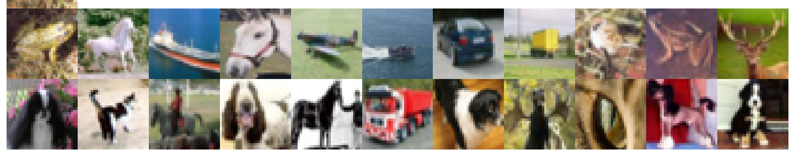
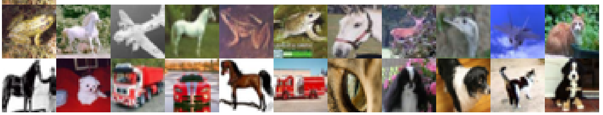
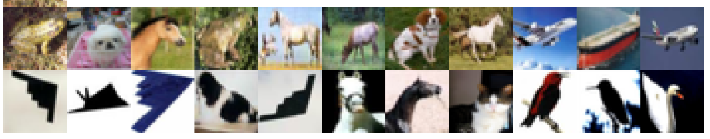
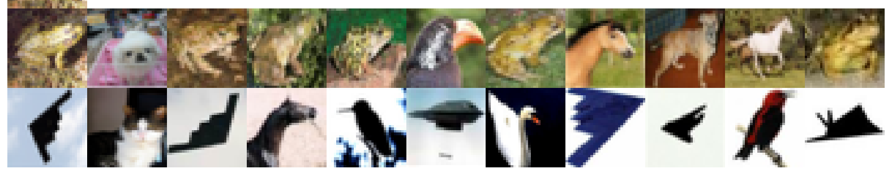

# Deep InfoMax

This is implementation of Deep InfoMax model from [Learning deep representations by mutual information estimation and maximization](https://arxiv.org/abs/1808.06670).
Implementation is made with Tensorflow 2. Model is trained on CIFAR-10. 
There are three types of model training was performed: optimizing local context only, optimizing global context only and optimizing both.

## Results
Results are presented in lines of CIFAR-10 images. 
Upper-left corner is the target image. Upper line shows images the closest contexts. Lower line is for the  most distant contexts.

For each training type there is two results: for global context and for averageg local context

#### Optimizing local context
Match by global context

Match by averaged local context

#### Optimizing global context
Match by global context

Match by averaged local context

#### Optimizing global and local contexts simultaneously
Match by global context

Match by averaged local context

## Requirements
* tensorflow == 2.2
* numpy
* matplotllib

